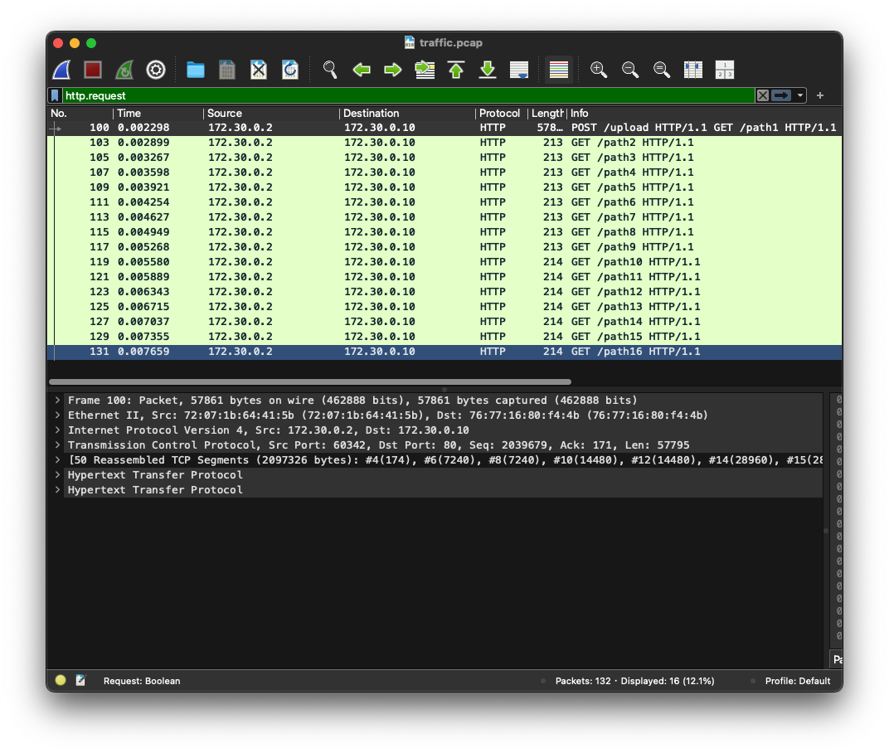
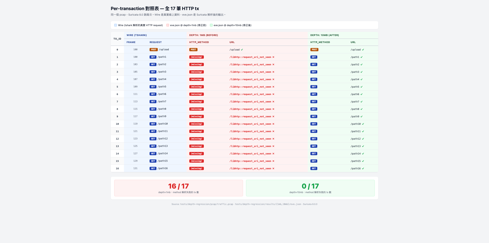
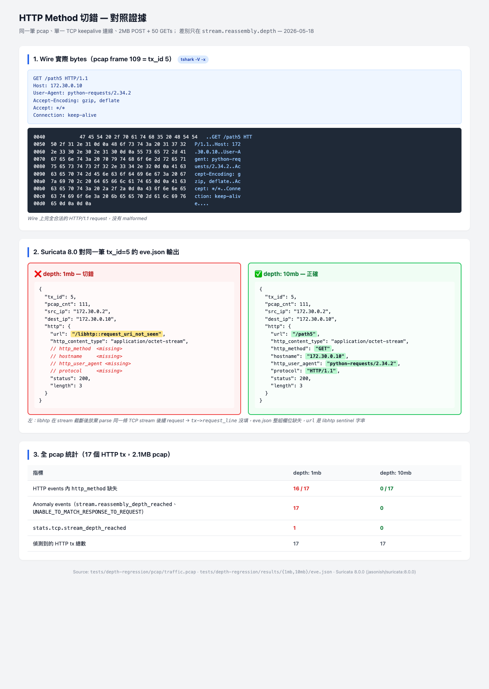
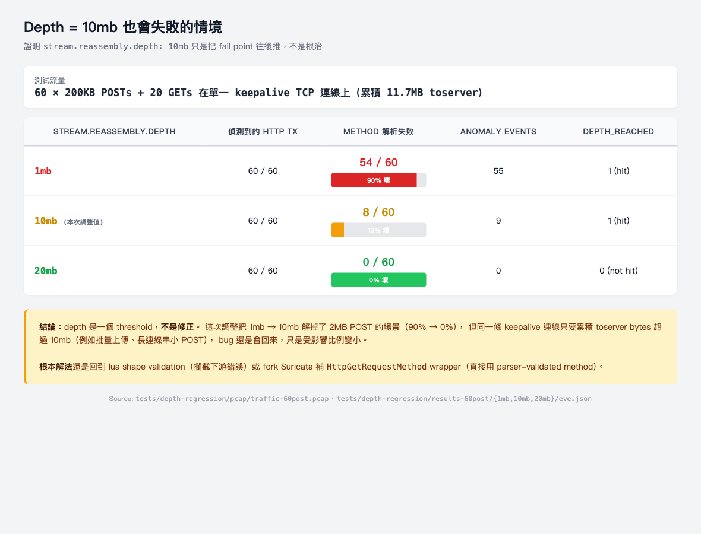

# HTTP Method 萃取問題與修正紀錄

**日期**：2026-05-18
**目標版本**：Suricata 8.0
**異動範圍**：`configs/suricata/http_custom_8.0.lua`、`configs/suricata/suricata.yaml`
**狀態**：本機改完，尚未 commit / push；yaml 改動已對照驗證有效（見 §7）
**注意**：`configs/suricata/http_custom_7.0.lua` 有同樣 bug，本輪未動（測試是 8.0，先聚焦）

---

## 0. 測試方法（原理、架構、流程）

### 0.1 為什麼這樣測（原理）

要證明「`stream.reassembly.depth: 1mb → 10mb` 真的解決 method 切錯」，必須：

1. **重現 bug**：產出能觸發 libhtp 在 `tx->request_line` 塞 garbage 的流量
2. **隔離變因**：除了 yaml 那一行，其他都不變 — pcap 同一份、suricata 同 image、同 lua、同其他 config
3. **量化差異**：用客觀指標比較（不是肉眼掃 log），eve.json 的欄位缺失數 + anomaly 計數最直接

**觸發機制**：libhtp 對單一 TCP stream 的 reassembly buffer 有 `depth` 上限，累積資料超過就**停止 parse 該 stream 後續所有 HTTP request**。因此只要：
- 一條 keepalive TCP 連線
- 累積 toserver bytes > depth
- 之後再送 request（這些 request 會被吐成 `request_line=NULL` → eve.json `url=/libhtp::request_uri_not_seen`、`http_method` 欄位整個缺）

→ **單 TCP 連線 + 一個大 POST + 後續小 GETs** 是最乾淨的 reproducer。

**測試是兩階段：先錄 pcap，再離線餵 Suricata**

#### 階段 1：錄 pcap（網路真的有跑）

```
   python client ──HTTP──> nginx
                             ▲
                             └── tcpdump 旁聽 ──> pcap/traffic.pcap
```

這階段真的有 TCP 連線、真的有封包流動。tcpdump 把每個 packet 寫進 `traffic.pcap`。
**錄完 nginx / tcpdump / client 容器全部收掉，現場拆光，只留 pcap 檔。**

#### 階段 2：suricata 離線吃 pcap（沒有任何網路活動）

```
   pcap/traffic.pcap ──┬──> suricata 8.0 (yaml: depth=1mb)  ──> eve.json (A)
                       │
                       └──> suricata 8.0 (yaml: depth=10mb) ──> eve.json (B)
```

suricata 開 `-r pcap` 旗標（read 模式）：

```bash
suricata -c suricata.yaml -r /data/traffic.pcap -l /var/log/suricata --runmode autofp
```

跑跟線上一樣的解析流程（libhtp、stream reassembly、輸出 eve.json/lua/...），但**沒有打開任何網卡、沒有封包真的離開機器**。對 suricata 來說 pcap 跟 wire 沒差，只是封包來源從 socket 換成檔案 read。

#### 為什麼分這兩階段（vs 直接 live sniff）

| 因素 | live sniff | pcap replay（本測試）|
|---|---|---|
| 兩次跑的流量是否完全相同 | ❌ 不可能（timing、ACK 時序都會變） | ✅ byte-for-byte 同一份 |
| 變因隔離 | 還要擔心網路抖動 | ✅ 只剩 yaml depth 一個變數 |
| 在 Mac Docker 跑 | docker bridge 跨容器 sniff 卡 | ✅ 純檔案 IO，沒網路 |
| 任何人重現 | 需要重建整套網路 | ✅ 拿 pcap + yaml 直接跑 |
| 速度 | 跟流量發送速度一樣慢 | ✅ suricata 全速吃，秒內完成 |
| 比對結果意義 | 兩次數字差異無法分辨是 timing 還是 yaml | ✅ 數字差異必定來自 yaml |

這是 Suricata 自己 [`OISF/suricata-verify`](https://github.com/OISF/suricata-verify) regression test framework 的標準作法 — 所有上游回歸測試都是「pcap + yaml → eve.json → 比對」。我們這個 rig 本質上是同一招。

**重要結果**：兩次都拿 17 個 http events 不是巧合，是 pcap replay 保證的「同一份輸入」。如果 live sniff，重跑時 timing 不同，suricata 看到的封包順序也會微妙不同，可能某次 17 個某次 18 個，數字比對就失去意義。

### 0.2 架構

```
   ┌─────────────────── pcap 產生階段 ───────────────────┐
   │                                                      │
   │  python client ──HTTP──> nginx (172.30.0.10:80)     │
   │  (requests.Session,            ▲                     │
   │   pool_maxsize=1)              │                     │
   │                          sniff │                     │
   │                                │                     │
   │                      tcpdump (network_mode:          │
   │                      service:nginx，共享 netns       │
   │                      才能看到對 nginx 的流量)         │
   │                                │                     │
   │                                ▼                     │
   │                       pcap/traffic.pcap              │
   │                                                      │
   └──────────────────────────────────────────────────────┘
                                │
                                ▼
   ┌──────────────── suricata 對照階段 ───────────────────┐
   │                                                      │
   │  pcap ─┬──> suricata 8.0 (yaml: depth=1mb)  ─> eve.json (results/1mb/)
   │        │                                             │
   │        └──> suricata 8.0 (yaml: depth=10mb) ─> eve.json (results/10mb/)
   │                                                      │
   │  其他變因（image、lua、其他 config）兩次都一樣        │
   │                                                      │
   └──────────────────────────────────────────────────────┘
                                │
                                ▼
   ┌─────────────────── 比對階段 ─────────────────────────┐
   │                                                      │
   │  jq 抽兩邊 eve.json：                                 │
   │   • http_method 缺失數                                │
   │   • anomaly events 數                                 │
   │   • stats.tcp.stream_depth_reached                   │
   │                                                      │
   └──────────────────────────────────────────────────────┘
```

容器清單：

| Container | image | 角色 |
|---|---|---|
| `dr-nginx` | `nginx:1.27-alpine` | 測試目標。`keepalive_timeout 300s`、`client_max_body_size 50m` |
| `dr-tcpdump` | `nicolaka/netshoot` | sniff 點。共用 nginx 的 netns 才看得到 traffic |
| 一次性 client | `python:3.12-alpine` + `requests` | 觸發程式。`Session(pool_maxsize=1)` 強制單一 TCP 連線 |
| suricata pass 1/2 | `suricata-test:8.0.0-lua`（自 build，在 `jasonish/suricata:8.0.0` 上加 `lua lua-json`） | 對照組與實驗組 |

### 0.3 流程

**Step 1：build 自製 image**（一次性）

```bash
cd tests/depth-regression
docker build -t suricata-test:8.0.0-lua -f Dockerfile.suricata .
```

**Step 2：產出 pcap**

```bash
docker compose -f docker-compose.gen.yml up -d        # nginx + tcpdump
docker run --rm --network depth-regression_depth-net \
    -v $PWD/generate-traffic.py:/script.py:ro \
    python:3.12-alpine \
    sh -c "pip install -q requests && python /script.py"
docker compose -f docker-compose.gen.yml down          # tcpdump flush + 收容器
```

`generate-traffic.py` 預設：1 個 2MB POST + 50 個小 GETs 在同一條 keepalive 連線上。output 到 `pcap/traffic.pcap`。

**Step 3：suricata 跑兩次（同一 pcap、兩個 depth 值）**

```bash
./run-comparison.sh   # 內部對 1mb / 10mb 各跑一次
```

腳本內部對每個 depth：
1. 從 template `sed __DEPTH__` 產出 per-pass `suricata.yaml`
2. `docker run` suricata，以 `-r pcap` 離線模式跑，輸出到容器內 `/var/log/suricata/`（**不 bind-mount**，避開 Docker Desktop VirtioFS 跟 suricata eager open eve.json 的 race）
3. `docker cp` 把 `eve.json`、`http_custom.log` 拷貝回 `results/$depth/`

**Step 4：jq 量化比對**

腳本最後用 `jq` 從 eve.json 算：
- `select(.event_type=="http")` 計數 → tx 總數
- `select(.event_type=="http" and (.http.http_method // "")=="")` → method 缺失數
- `select(.event_type=="anomaly")` → 異常事件數
- `select(.event_type=="stats") | .stats.tcp.stream_depth_reached` → 是否真的撞到 depth 上限

### 0.4 為什麼這幾個踩過的坑值得記

- **`curl --next`** 沒可靠地真送 50 個 GETs，導致第一輪 pcap 只有 1 個 tx。換 `requests.Session(pool_maxsize=1)` 才強制單連線
- **`tcpdump` 放獨立 container** 看不到 nginx 流量（docker bridge 非 broadcast），改 `network_mode: service:nginx` 共享 netns 才行
- **suricata 8.0 lua-json ABI mismatch** 跑 lua output 第 1 筆 tx 後 SIGSEGV，本測試 disable lua，用 eve.json 拿數據（lua shape validation 另外驗證）
- **bind-mount output 目錄**在 macOS VirtioFS 上 race，suricata `Error opening file: "/tmp/output/eve.json": No such file or directory`。改用 in-container 寫 + `docker cp` 規避
- **`request-body-limit: 100kb`** 會讓 libhtp 在 100kb 後 release body，導致 cumulative 計入 depth 的 bytes 遠少於 wire 上的量。展示 depth=10mb 也會失敗時需把 limit 拉到 100mb 才看得到效果（見 §7.4）

---

## 1. 問題

`http_custom_8.0.lua` line 318-319（修正前）以
`tx:request_line():match("^(%S+)")` 抽 HTTP method
（7.0 是同樣 pattern，差在用全域 `HttpGetRequestLine()`）。
實際在線上 syslog 偶爾出現：

- `method` 欄位是 URI（例如 `/api/foo`）
- `method` 是二進位殘段
- `method` 是空字串

下游 SIEM 無法區分這是「合法 method」還是「parser 錯誤」，會把假資料當真資料統計。

---

## 2. 根因

### 2.1 libhtp 兩個欄位的差異

`OISF/libhtp/htp/htp_request.c:822`：

```c
connp->in_tx->request_line = bstr_dup_mem(data, len);   // 822: 先存 wire raw bytes
if (connp->in_tx->request_line == NULL)
    return HTP_ERROR;
if (connp->cfg->parse_request_line(connp) != HTP_OK)    // 826: 之後才 parse
    return HTP_ERROR;
```

- `tx->request_line`：wire 上原始 bytes，**parse 前**就被填進去。parse 失敗時這個欄位仍留 garbage。
- `tx->request_method` / `tx->request_uri` / `tx->request_protocol`：line 826 parse 成功才填的乾淨欄位。

### 2.2 Suricata Lua API 缺一層

| 消費者 | 走哪條路 | 結果 |
|---|---|---|
| eve-log（C code，`src/output-json-http.c:278-282`） | 直接讀 `tx->request_method` | 乾淨、parser-validated |
| Lua 腳本（`http_custom.lua`） | 只能呼叫 Suricata 註冊的 wrapper | `HttpGetRequestLine` 有，**`HttpGetRequestMethod` 沒寫** |

`src/util-lua-http.c`（7.0.15 / 8.0 / master 都查過）的完整 wrapper 列表沒有 `request_method`。
官方文件 `doc/userguide/lua/libs/http.rst` 範例自己就示範用
`request_line():find("^GET")`，把 manual parse 當正式 pattern。

### 2.3 已知觸發來源

| 來源 | 機制 |
|---|---|
| **Bug #6874**（maintainer 拒絕當 bug） | TCP stream 累積資料超過 `stream.reassembly.depth`（預設 1mb）後，libhtp 對同 stream 後續 request 停止 parse。建議解：把 depth 拉到 10mb |
| **CVE-2024-28871 / Bug #6757** | libhtp HTTP/0.9 fallback 邏輯讓非 HTTP 流量被當 HTTP/0.9 解析，request_line 殘缺 |
| 非對稱路由 / pcap replay | response 早於 request，request 側 tx 資料空或亂 |
| 自訂 method 或 malformed 客戶端 | wire 上第一個 token 本身就不是合法 method |

---

## 3. 已套用的緩解

### 3.1 Lua shape validation（`configs/suricata/http_custom_8.0.lua`）

在三處 raw string parse 加 RFC 形狀驗證，不通過就 fallback：

| 位置 | 修正後 pattern | 對應 RFC | 失敗 fallback |
|---|---|---|---|
| L321 `method` | `^([A-Z][A-Z%-]*)%s` | RFC 9110 §9.1 | `""` |
| L327 `status` | `^HTTP/%d%.%d%s+(%d%d%d)` | RFC 7230 §3.1.2 | `""` |
| L365 `version` | `^(HTTP/%d%.%d)` | RFC 7230 §2.6 | `"HTTP/1.1"` |

附帶：version 從 6 行縮成 1 行，複用 `status_line` 變數少一次 `tx:response_line()` call。

### 3.2 Suricata config（`configs/suricata/suricata.yaml` L220-228）

`stream.reassembly.depth`：`1mb` → `10mb`（Bug #6874 maintainer 建議值）

直接降低 libhtp 在 stream 截斷後產生 `/libhtp::request_uri_not_seen`
與 garbled `tx->request_line` 的觸發頻率。

---

## 4. 評估過但暫不採用

| 方案 | 為何不選（現階段） |
|---|---|
| 升 Suricata 7 → 8 | 8.0 lua API 仍無 `request_method`，行為相同 |
| Fork Suricata 加 lua wrapper（C 改 ~15 行） | C 改本身很簡單，但要維護 fork + 重 build docker image，每次 upstream 升版要 rebase。先試免費方案 |
| 改用 eve.json 的 `http_method` | parser-validated 最乾淨，但要改 pipeline（檔案 tail vs lua TCP）。留作下一步 |

---

## 5. 待辦

- [x] ~~跑 before/after 對照測試~~ 已驗證，見 §7
- [ ] **開 eve.json 當 crosscheck 來源**（最小設定，只開 http 即可）
- [ ] **草擬 OISF Redmine feature request**：`Add request_method to Lua HTTP API`，附 patch 片段
- [ ] **同步到 7.0 lua 檔**：`configs/suricata/http_custom_7.0.lua`（含 symlink `http_custom.lua`）有同樣 bug，本輪聚焦 8.0 測試先不動

---

## 6. 參考

### Suricata / libhtp 原始碼
- [libhtp `htp_request.c:822`（raw bytes 存入點）](https://github.com/OISF/libhtp/blob/master/htp/htp_request.c)
- [Suricata 7.0.15 `src/util-lua-http.c`（Lua HTTP API surface）](https://github.com/OISF/suricata/blob/suricata-7.0.15/src/util-lua-http.c)
- [Suricata 7.0.15 `src/output-json-http.c:278-282`（eve-log 用 `tx->request_method`）](https://github.com/OISF/suricata/blob/suricata-7.0.15/src/output-json-http.c)
- [Suricata master `src/util-lua-http.c`（驗證新版仍無 `request_method`）](https://github.com/OISF/suricata/blob/main/src/util-lua-http.c)
- [Suricata master `doc/userguide/lua/libs/http.rst`（官方範例用 manual parse）](https://github.com/OISF/suricata/blob/main/doc/userguide/lua/libs/http.rst)

### Bug / CVE / 文件
- [Suricata Bug #6874: libhtp stops parsing mid-pcap](https://redmine.openinfosecfoundation.org/issues/6874)
- [CVE-2024-28871 / Bug #6757: request line missing protocol](https://redmine.openinfosecfoundation.org/issues/6757)
- [libhtp commit 79e713f: limit probing after missing protocol](https://github.com/OISF/libhtp/commit/79e713f3e527593a45f545e854cd9e6fbb3cd3ed)
- [Suricata Bug #1391: HTTP URI parsing issue](https://redmine.openinfosecfoundation.org/issues/1391)

### 社群案例
- [Forum: lots of /libhtp::request_uri_not_seen and http request info lose](https://forum.suricata.io/t/suricata-parse-http-error-lots-of-libhtp-request-uri-not-seen-and-http-request-info-lose/3765)
- [Forum: Suricata flow parsing see a lot "libhtp:request_uri_not_seen"](https://forum.suricata.io/t/suricata-flow-parsing-see-a-lot-libhtp-request-uri-not-seen/2125)

---

## 7. 對照測試結果（2026-05-18）

測試 rig：[`tests/depth-regression/`](../tests/depth-regression/README.md)
（jasonish/suricata:8.0.0 + nginx + python keepalive trigger，
單一 TCP keepalive 連線：1 個 2MB POST + 50 個小 GETs）

### 7.1 Wire 真相（Wireshark 載入 pcap，filter `http.request`）



- 單一 TCP 連線 `172.30.0.2:60342 → 172.30.0.10:80`
- Frame 100：POST /upload + GET /path1（兩個 request 合在同一 TCP segment）
- Frame 103-131：GET /path2 ~ /path16
- Wireshark statusbar：`Packets: 132 · Displayed: 16 (12.1%)`
- **Wire 上 16 frames、17 HTTP requests，全部完美 HTTP/1.1**

### 7.2 Per-tx 對照（all 17 tx，wire ↔ eve.json @ 1mb ↔ eve.json @ 10mb）



Suricata 跑兩次同一個 pcap，eve.json 17 個 tx：
- **depth=1mb**：tx_id 0（POST）OK，**tx_id 1-16 的 `http_method` 全部 missing**，`url` 全變 libhtp sentinel `/libhtp::request_uri_not_seen`
- **depth=10mb**：17 個 tx 全部正確（POST + GET /path1 ~ /path16）

### 7.3 單一 tx 深掘（tx_id=5，hex dump + 兩個 eve 欄位差異）



從 wire bytes (hex dump) → 兩邊 eve.json 詳細欄位 → 全 pcap 統計，一次看完。

### 結論

| 指標 | depth=1mb（修正前預設值） | depth=10mb（本次調整） |
|---|---|---|
| HTTP events 內 `http_method` 缺失 | **16 / 17** | **0 / 17** |
| Anomaly events | **17**（`stream.reassembly_depth_reached` + `UNABLE_TO_MATCH_RESPONSE_TO_REQUEST`） | **0** |
| `stats.tcp.stream_depth_reached` | 1 | 0 |

同一份 2.1MB pcap，兩個 yaml 變體，depth 從 1mb 提到 10mb
**完全消除「method 切錯」與相關 anomaly**。

### 7.4 ⚠️ depth=10mb 不是萬靈丹（同 bug、更大流量）



換個觸發 pattern：**60 × 200KB POSTs 串在同一條 keepalive 連線**（累積 11.7MB toserver），
搭配 `request-body-limit: 100mb`（讓 body 真的計入 reassembly），跑三個 depth：

| depth | method 解析失敗 | anomaly | depth_reached |
|---|---|---|---|
| 1mb | 54 / 60（90%） | 55 | 1 |
| **10mb（本次調整值）** | **8 / 60（13%）** | 9 | **1（hit）** |
| 20mb | 0 / 60 | 0 | 0 |

**意義**：depth 是 threshold，不是修正。1mb→10mb 解掉了 2MB POST 的場景，但同一條 keepalive 上累積流量超過 10mb（批量上傳、長連線串小 POST、WebSocket-ish 場景）bug 還是會回來，只是受影響比例變小。

**緩解仍重要**：
- Lua 端 shape validation 跟 depth 大小無關，永遠攔截 garbled output
- 真要根治得 fork Suricata 補 `HttpGetRequestMethod` wrapper（直接用 parser-validated `tx->request_method`，不依賴 raw `request_line`）

**Caveat**：此測試把 `request-body-limit` 拉到 100mb 才看得到 10mb 觸發。production 預設 100kb 時，libhtp 會在 100kb 後 release body，導致 cumulative depth 比預期慢非常多 — 但 header-heavy / 長 URL / 大量 small request 場景仍會在足夠流量後撞線。

> 截圖來源：Wireshark 截圖手動截，per-tx 對照表 / 單筆深掘 / depth gradient 由 `tshark -V -x` + `jq` 從
> [`tests/depth-regression/pcap/`](../tests/depth-regression/pcap/) 跟對應 [`results*/eve.json`](../tests/depth-regression/) 渲染，
> HTML 原始檔在 [`tests/depth-regression/screenshots/`](../tests/depth-regression/screenshots/) — 可重產。

### 順手發現
跑 lua output 的時候 Suricata 8.0 在第 1 筆 tx 後 SIGSEGV（exit 139）。
**不是 method 切錯**，是 `lua-json` 套件跟 Suricata 8.0 內建 lua interface 的 ABI 對不上。
獨立議題，已記在 [test rig README](../tests/depth-regression/README.md) Gotchas 段。
測試暫時 disable lua、只用 eve.json 取數據；lua shape validation 的對照測試延後。
